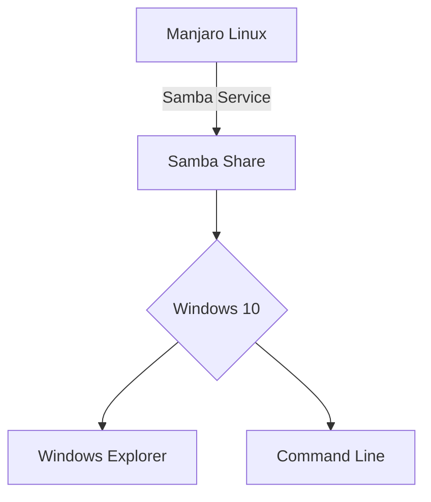

# Setting Up and Connecting to a Samba Share 🗄️

This README provides a comprehensive guide for setting up a Samba server on Manjaro Linux 🐧 and connecting to it from a Windows client 🖥️.

## Table of Contents 📝

- [Prerequisites](#prerequisites)
- [Manjaro Samba Server Setup](#manjaro-samba-server-setup)
- [Windows Client Setup](#windows-client-setup)
- [Troubleshooting](#troubleshooting)
- [Example Samba Share Configuration](#example-samba-share-configuration)
  
---

## Prerequisites 🛠️

- Manjaro Linux machine for Samba server
- Windows 10 machine for client
- Terminal access on Manjaro
- Admin rights on Windows

---

## Manjaro Samba Server Setup 🐧

### Install Necessary Packages 📦

```bash
sudo pacman -S samba gvfs-smb smbclient
```

### Add a System User 🙍‍♂️

```bash
sudo useradd -M your_username
```

### Set Samba Password 🛡️

```bash
sudo smbpasswd -a your_username
```

### Activate the User 🔒

```bash
sudo smbpasswd -e your_username
```

### Update `smb.conf` 📝

Edit `/etc/samba/smb.conf` and add:

```ini
[Your_Share]
    path = /path/to/share
    valid users = your_username
    read only = no
```

### Restart Samba Service 🔄

```bash
sudo systemctl restart smbd
sudo systemctl restart nmbd
```

---

## Windows Client Setup 🖥️

### Use Windows Explorer 🗂️

1. Open "This PC"
2. Choose "Map Network Drive"
3. Provide the network path: `\\Server_IP_Address\Share_Name`
4. Choose "Reconnect at login"

### Use Command Line 🖥️

```cmd
net use Z: \\Server_IP_Address\Share_Name /user:your_username your_password /persistent:yes
```

---

## Troubleshooting 💡

- Always check the Samba and network service statuses if you run into issues.

```bash
sudo systemctl status smbd
sudo systemctl status nmbd
```

---

## Example Samba Share Configuration 📑

Here is an example of a typical Samba share configuration from the `smb.conf` file:

```ini
[My_Share]
    path = /home/my_share
    valid users = john_doe
    read only = no
```



---

Feel free to modify this guide according to your requirements. This should provide a strong foundation for setting up and connecting to a Samba server from Manjaro Linux to Windows 10. 🌐💻
